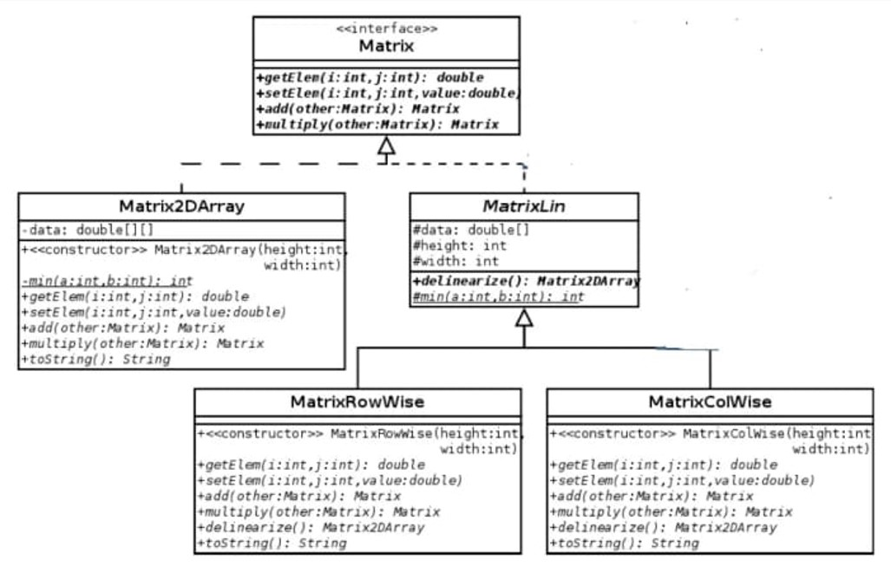
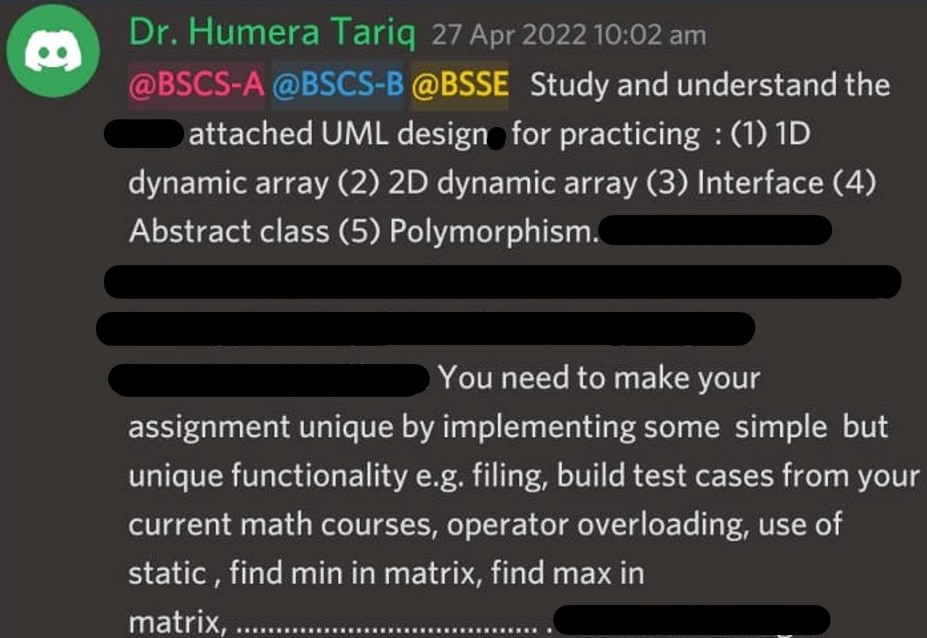

### UML DIAGRAM (Problem Description)

### HINTS & GUIDE

### NOTE (Learning Outcomes)
In this problem, You will also learn following concepts:
1) Mapping Generalized UML as Interface/Abstract class problem
2) Use of void* pointer in Abstract class
3) Various explicit typecasting formats required for accessing void* pointed objects/elements
4) How to avoid Object-Slicing when accessing concrete class objects through base class pointer
